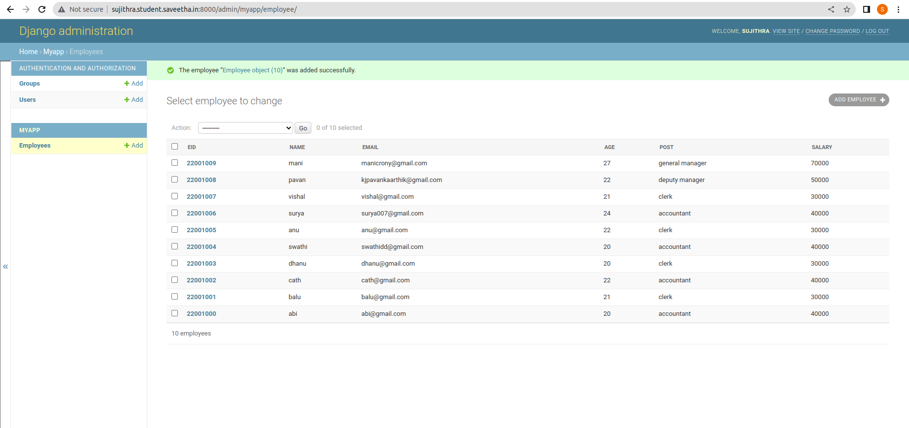
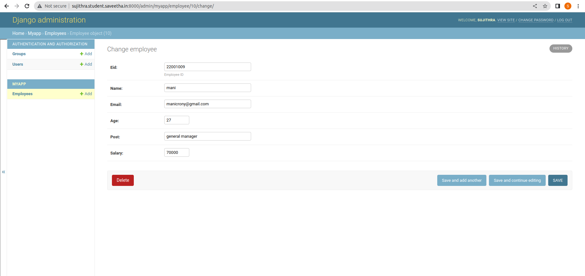

# Django ORM Web Application

## AIM
To develop a Django application to store and retrieve data from a database using Object Relational Mapping(ORM).

## DESIGN STEPS

### STEP 1:

Create a new a new Django project using "django-admin startproject",get into the
project terminal and use "python3 manage.py startapp" command.

### STEP 2:

Define a model for the Employee details in the models.py . Allow host access and add
the app name under installed apps in settings.py.

### STEP 3:

Register the models with the Django admin site.In admin.py under app folder,register
the models with Django admin site.

## PROGRAM

#IN models.py

from django.db import models
from django.contrib import admin

#Create your models here.
class Employee(models.Model):
    eid=models.CharField(max_length=20,help_text="Employee ID")
    name=models.CharField(max_length=100)
    email=models.EmailField()
    age=models.IntegerField()
    post=models.CharField(max_length=30)
    salary=models.IntegerField()

class EmployeeAdmin(admin.ModelAdmin):
    list_display=('eid','name','email','age','post','salary')

#IN admin.py

from django.contrib import admin
from .models import Employee,EmployeeAdmin

#Register your models here.
admin.site.register(Employee,EmployeeAdmin)

## OUTPUT

### Employee Database

### Adding data

## RESULT

Successfully developed a Django application to store and retrieve data from a
database using Object Relational Mapping(ORM).